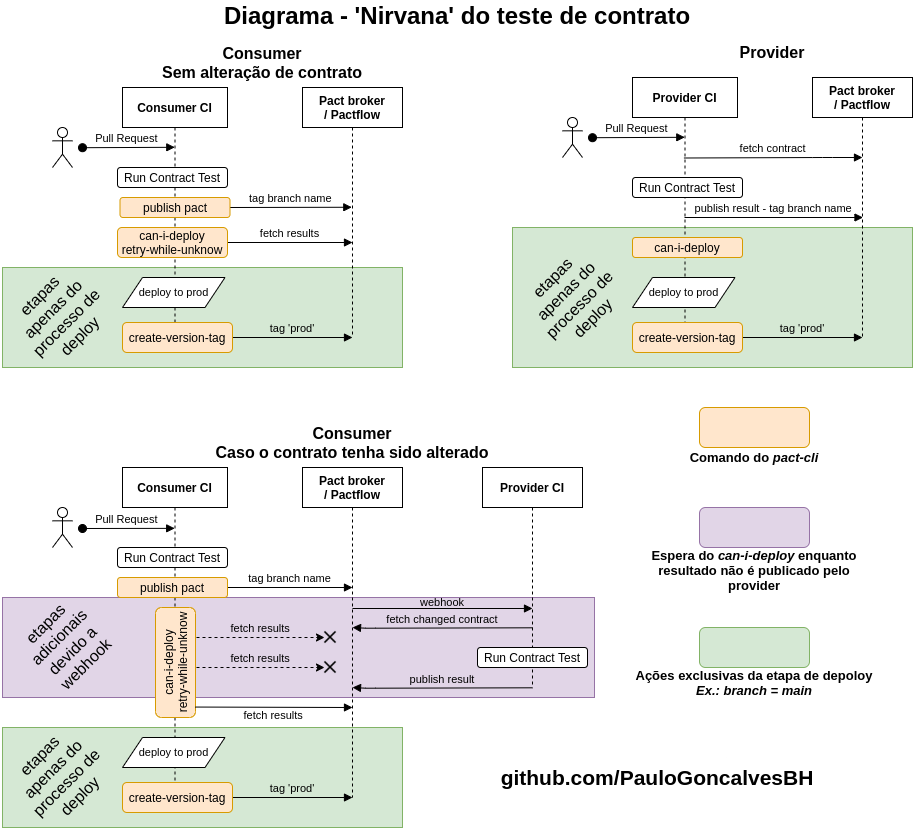
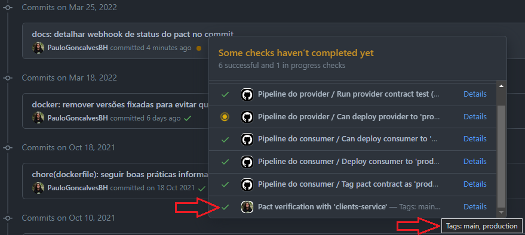

<div align="center">
  <h1>Exemplo de 'Nirvana' do teste de contrato</h1>
  <h4>Esse repositório exemplifica as melhores implementações de teste de contrato, atingindo o <i>nirvana</i> e tendo controle via pipeline e pact-broker de maneira totalmente confiável, fornecendo segurança para seguir com deploy.</h4>
</div>
<br>

> **Gostaria de aprender teste de contrato do 0 ao avançado? Forneço treinamento prático, basta me contatar via [Linkedin](https://www.linkedin.com/in/paulo-goncalves) que envio a proposta com toda a grade e detalhes importantes.**

## Base de teste de contrato

Para aproveitar o repositório da melhor maneira consulte os seguintes materiais, necessários para conhecer os conceitos de teste de contrato:

1. [Introduction - Documentação do Pact](https://docs.pact.io/)
1. [AT Talks: Teste de contrato com Pact](https://www.youtube.com/watch?v=1c2JmM9dafA)
1. [Testes de contratos com PACT #1 Conceitos - Vinícius Ribeiro](https://www.zup.com.br/blog/testes-de-contratos-com-pact-1-conceitos)

## Sobre o repositório

O intuito desse material é demonstrar como deve ser a implementação de pipeline e testes de contrato de aplicações provider e consumer de forma com que siga o que é considerado o [Nirvana do Pact](https://docs.pact.io/pact_nirvana/).

O diagrama abaixo é a representação do Nirvana do Pact que foi implementado nesse repositório.



O _pact-cli_ informado no diagrama se refere a comandos do [Pact Broker Client](https://github.com/pact-foundation/pact_broker-client).

---

# Aplicações

As aplicações utilizadas estão divididas em 2 diretórios, tendo cada um seus arquivos fonte (_/src_), testes, dockerfile, package.json, etc, bem como cada aplicação tem sua pipeline implementada em [.github/workflows](./.github/workflows).

## Provider - clientsService

O provider é a aplicação que provem API para ser consumido por outro serviço. Está em [provider-clients-service](./provider-clients-service).

> A [pipeline do provider](./.github/workflows/provider-ci.yml) é executada apenas quando há alteração fora do diretório `consumer-frontend` (_consumer_).

## Consumer - Frontend

O consumer é a aplicação que consome outra API. Pode também ser um provider. Está em [consumer-frontend](./consumer-frontend).

> A [pipeline do consumer](./.github/workflows/consumer-ci.yml) é executada apenas quando há alteração fora do diretório `provider-clients-service` (_provider_).

# Execução

## Pré-requisitos

- [Docker](https://docs.docker.com/get-docker/) e [Docker-compose](https://docs.docker.com/compose/install/) instalados.

## Teste de contrato do Consumer

```sh
make consumer-test-contract
```

Após a execução é gerado o contrato em [consumer-frontend/pacts](./consumer-frontend/pacts) e [log](./consumer-frontend/logs).

Como demonstrado no diagrama, a publicação do pact gerado no Pactflow é feita utilizando o comando _publish_ do _pactfoundation/pact-cli_ e apenas no CI, como pode ser visto na pipeline [consumer-ci](.github/workflows/consumer-ci.yml).

## Teste de contrato do Provider

```sh
make provider-test-contract
```

Para conseguir executar o teste do provider altere o arquivo [docker-compose](docker-compose.yml) conforme o exemplo abaixo para utilizar o token de leitura do Pactflow e possibilitar que baixe os contratos publicados pelo consumer.

```diff
    environment:
-     - PACT_BROKER_TOKEN
+     - PACT_BROKER_TOKEN=7L0Ijmqyh7LOMk5DyqteLQ
      - PACT_URL
```

A publicação de resultado da execução é feito apenas via CI e com token de escrita. (`publishVerificationResult: process.env.CI == 'true'`)

## Webhooks

### Webhook de trigger de teste de contrato no Provider

Quando o consumer publica um novo contrato é preciso garantir que o provider tenha feito execução encima desse contrato.

Para que isso ocorra é utilizado webhook no Pactflow que, ao identificar que foi publicado contrato com conteúdo alterado ou uma nova tag (nova branch), trigga a pipeline do provider passando a URL desse contrato.

> A pipeline chamada via webhook é a [provider-ci-triggered-by-webhook.yml](./.github/workflows/provider-ci-triggered-by-webhook.yml).

A configuração do `can-i-deploy` na pipeline do consumer permite que aguarde a execução do teste de contrato pelo provider e a publicação do resultado para saber se é possível ou não prosseguir com o novo contrato.

#### Print de configuração do webhook de trigger:


### Webhook para publicar resultado

É importante que os times possuam visibilidade sobre a integração entre as aplicações, e a forma encontrada para isso no teste de contrato é publicar o resultado do teste de contrato executado no lado do provider no status do commit no repositório do consumer.

Toda vez que o teste de contrato for executado do lado do provider, independentemente do status desse teste, será publicado no repositório do consumer o resultado da integração entre as aplicações com um link para o pactflow.

> Será preciso criar 1 webhook para cada consumer

#### Print de status do Pact no commit do Consumer

O status no commit mostra quais provider verificaram o consumer publicado e quais tags foram executadas.

No exemplo da imagem o consumer está integrando com sucesso com o provider _clients-service_ que está publicado em `production` e na branch `main`.

Ao clicar em _details_ abrirá a página do Pactflow contendo o contrato publicado no commit e todos os detalhes da execução.



#### Print de configuração do webhook de status do resultado no commit:


---

[LICENSE GNU General Public License v3.0](./LICENSE)
