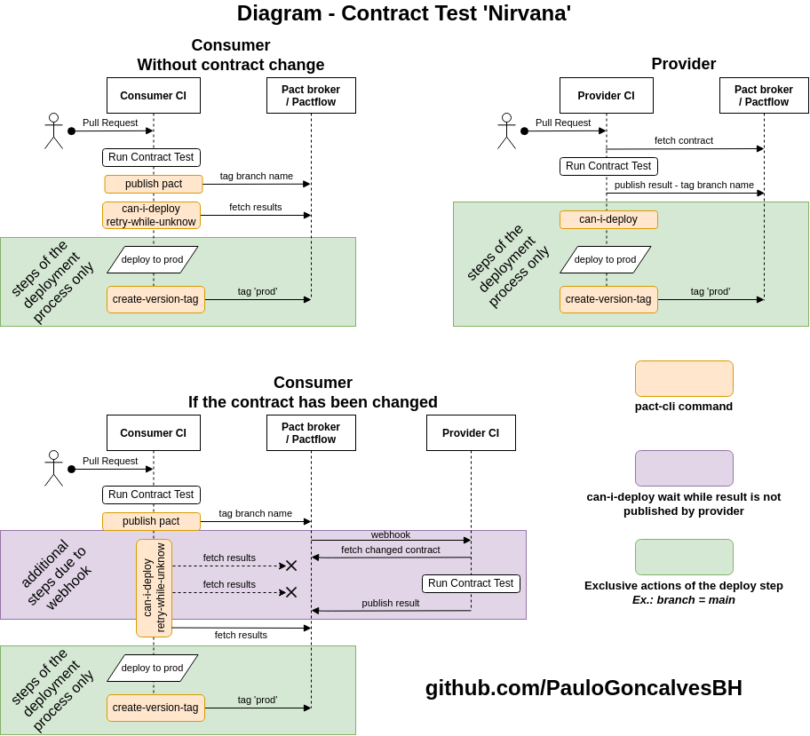

<div align="center">
  <h1>Contract test example - Pact Nirvana</h1>
  <h4>This repository exemplifies the best implementations of contract testing, reaching 'nirvana' and having control via pipeline and pact-broker in a completely reliable way, providing security to go ahead with deploy.</h4>
  <b><i>Give the repository a star ⭐, it encourages me to create advanced software quality content 100% free</i></b>
</div>
<br>

> **Would you like to learn contract test from 0 to advanced? I provide practical training, just contact me via [Linkedin](https://www.linkedin.com/in/paulo-goncalves) or by email _pact.training@paulog.dev_ and I'll send you the proposal with all the grid and important details.**

## Contract test basis

To get the most out of the repository, see the following materials, which you need to learn about contract testing concepts:

1. [Introduction - Pact documentation](https://docs.pact.io/)
1. [The steps for reaching Pact Nirvana - Pact documentation](https://docs.pact.io/pact_nirvana)
1. [[Portuguese] AT Talks: Contract test with Pact - Paulo Gonçalves](https://www.youtube.com/watch?v=1c2JmM9dafA)
1. [[Portuguese] Contract tests with PACT #1 Concepts - Vinícius Ribeiro](https://www.zup.com.br/blog/testes-de-contratos-com-pact-1-conceitos)

## About the repository

The purpose of this material is to demonstrate how the implementation of pipeline and contract testing of provider and consumer applications should be in a way that follows what is considered the [Pact Nirvana](https://docs.pact.io/pact_nirvana/).

The diagram below is the representation of the Pact Nirvana that was implemented in this repository.



The _pact-cli_ informed in the diagram refers to [Pact Broker Client](https://github.com/pact-foundation/pact_broker-client) commands.

---

# Applications

The applications used are divided into 2 directories, each with its source files (_/src_), tests, dockerfile, package.json, etc., as well as each application has its pipeline implemented in [.github/workflows](./.github/workflows).

## Provider - clientsService

The provider is the application that provides an API to be consumed by another service. It's in [provider-clients-service](./provider-clients-service).

> The [provider pipeline](./.github/workflows/provider-ci.yml) runs only when there is a change outside the `consumer-frontend` (_consumer_) directory.

## Consumer - Frontend

The consumer is the application that consumes another API. It can also be a provider. It's in [consumer-frontend](./consumer-frontend).

> The [consumer pipeline](./.github/workflows/consumer-ci.yml) runs only when there is a change outside the `provider-clients-service` (_provider_) directory.

# Execution

## Prerequisites

- [Docker](https://docs.docker.com/get-docker/) and [Docker-compose](https://docs.docker.com/compose/install/) installed.

## Consumer contract test

```sh
make consumer-test-contract
```

After execution, the contract is generated in [consumer-frontend/pacts](./consumer-frontend/pacts) and [log](./consumer-frontend/logs).

As shown in the diagram, publishing the generated pact in Pactflow is done using the _publish_ command from _pactfoundation/pact-cli_ and only in CI, as can be seen in the [consumer-ci](.github/workflows/consumer-ci.yml) pipeline.

## Provider contract test

```sh
make provider-test-contract
```

To be able to run the provider test, change the [docker-compose](docker-compose.yml) file as shown in the example below to use the Pactflow read token and allow you to download the contracts published by the consumer.

```diff
    environment:
-     - PACT_BROKER_TOKEN
+     - PACT_BROKER_TOKEN=7L0Ijmqyh7LOMk5DyqteLQ
      - PACT_URL
```

Publishing the execution result is done only via CI and with a writing token. (`publishVerificationResult: process.env.CI == 'true'`)

## Webhooks

### Webhook that trigger test contract on Provider

When the consumer publishes a new contract, it is necessary to ensure that the provider has performed on top of this contract.

For this to happen, a webhook is used in Pactflow which, when identifying that a contract with changed content or a new branch has been published, triggers the provider's pipeline by passing the URL of this contract.

> The pipeline called via webhook is [provider-ci-triggered-by-webhook.yml](./.github/workflows/provider-ci-triggered-by-webhook.yml).

The configuration of `can-i-deploy` in the consumer pipeline allows it to wait for the contract test to be executed by the provider and the publication of the result to know whether or not it is possible to proceed with the new contract.

#### Trigger webhook configuration print:


### Webhook to publish result

It is important that teams have visibility into the integration between applications, and the way found for this in contract testing is to publish the result of the contract test performed on the provider side in the commit status in the consumer repository.

Every time the contract test is executed on the provider side, regardless of the status of this test, the result of the integration between the applications will be published in the consumer repository with a link to the pactflow.

> You will need to create 1 webhook for each consumer

#### Pact status print on Consumer commit

The status on commit shows which providers have verified the published consumer and which branch have been executed.

In the example in the image, the consumer is successfully integrating with the _client-service_ provider that is deployed to `production` and in the `main` branch.

Clicking on _details_ will open the Pactflow page containing the contract published in the commit and all the execution details.


#### Output status webhook configuration print on commit:


---

[LICENSE GNU General Public License v3.0](./LICENSE)
